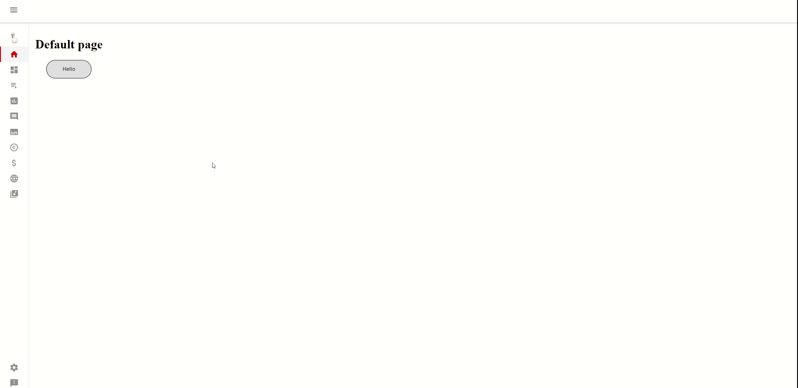

# AngularPOC

## Description

A simple Angular SpringBoot application.  
This project has no define goal, it is just to train and show some cool features.

-------
## Demo

    

-------
## Content idea
- [ ] Custom 3D carousel
- [ ] Tower of heroes
- [ ] Custom cards

-------
## Bugs
- Toggle button's value is not persisted
- When changing url through buttons, item selected on sidenavbar is not updated

