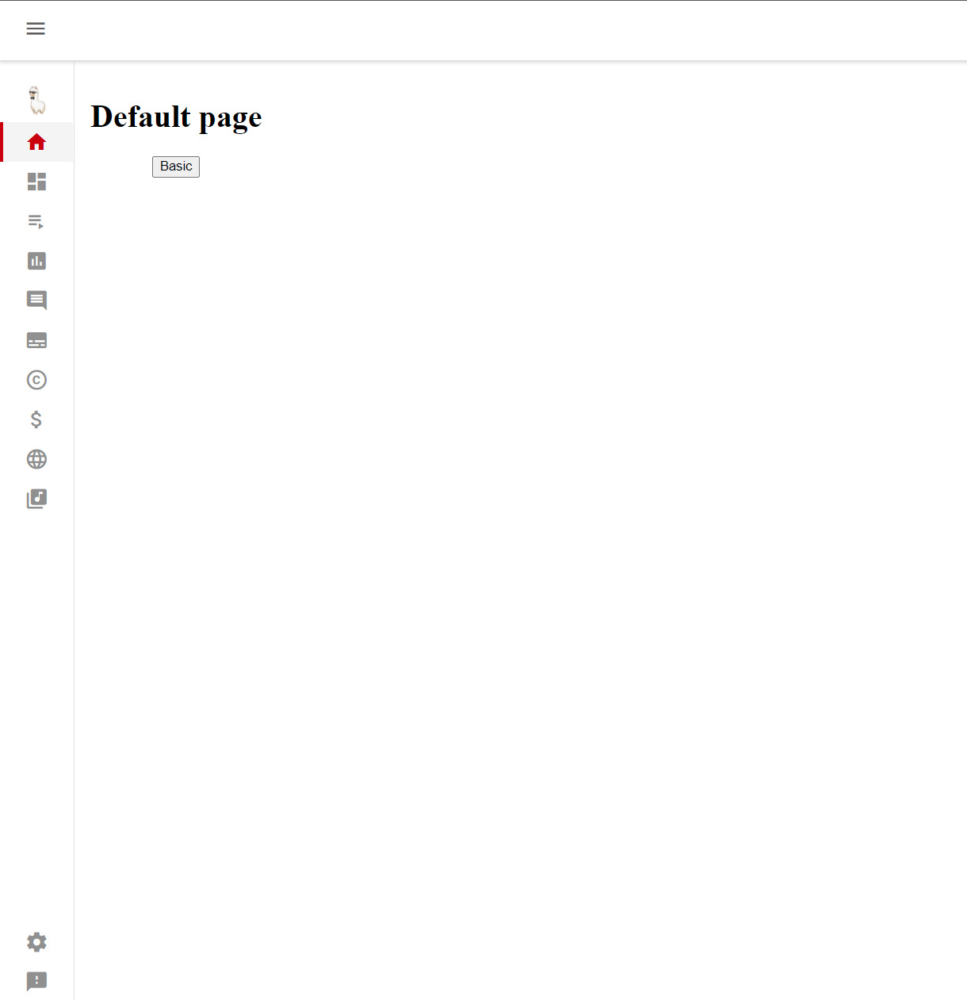
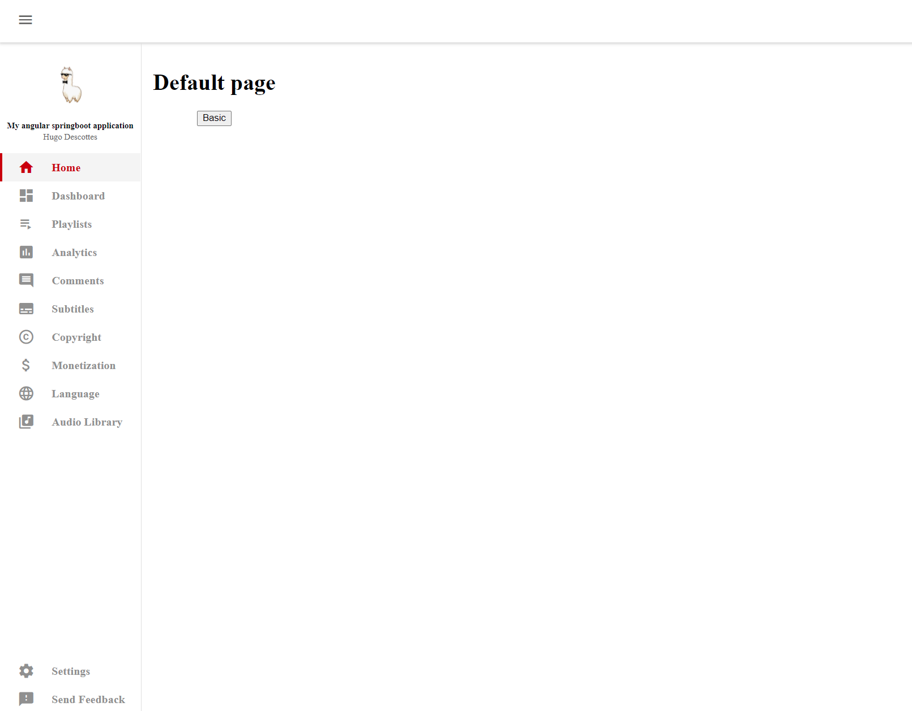

# AngularPOC

## Description

A simple Angular SpringBoot application.  
This project has no define goal, it is just to train and show some cool features.

-------
## Demo

    
    

-------
## Content idea
- [x] Custom sidenav bar (youtube style)

- [ ] Custom button

